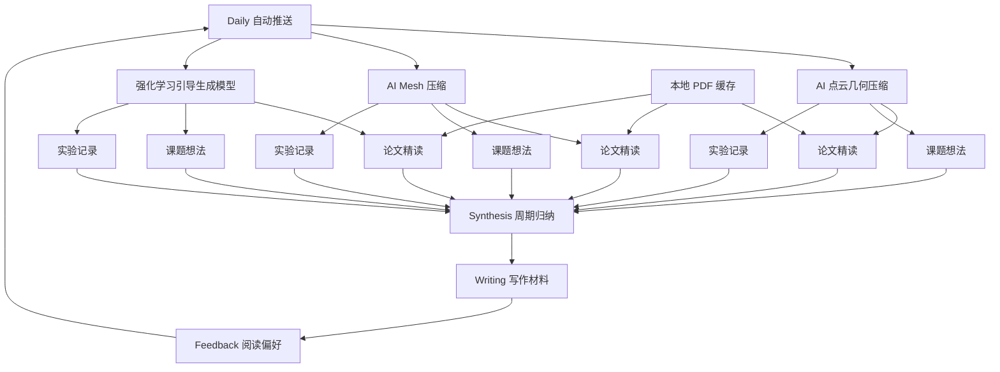

# Knowledge Map

这是整个研究工作台的总览入口。日常可以从这里跳到自动推送、方向笔记、PDF、写作材料和反馈偏好。

## 入口

- [[../Daily/2026-05-30|最近一次每日推送]]
- [[../Topics/point_cloud_geometry_compression/Daily/2026-05-30|AI 点云几何压缩日报]]
- [[../Topics/mesh_compression/Daily/2026-05-30|AI Mesh 压缩日报]]
- [[../Topics/rl_guided_generation/Daily/2026-05-30|强化学习引导生成模型日报]]
- [[../Feedback/reading_preferences|阅读偏好与反向需求]]

## 三个研究方向

### AI 点云几何压缩

- 精读笔记：[[../Topics/point_cloud_geometry_compression/Papers]]
- 课题想法：[[../Topics/point_cloud_geometry_compression/Ideas]]
- 实验记录：[[../Topics/point_cloud_geometry_compression/Experiments]]

### AI Mesh 压缩

- 精读笔记：[[../Topics/mesh_compression/Papers]]
- 课题想法：[[../Topics/mesh_compression/Ideas]]
- 实验记录：[[../Topics/mesh_compression/Experiments]]

### 强化学习引导生成模型

- 精读笔记：[[../Topics/rl_guided_generation/Papers]]
- 课题想法：[[../Topics/rl_guided_generation/Ideas]]
- 实验记录：[[../Topics/rl_guided_generation/Experiments]]

## 写作与归纳

- [[../Synthesis|Synthesis]]
- [[../Writing|Writing]]
- [[../Papers|本地 PDF 缓存]]

## 使用节奏

1. 每天从 `Daily` 看 15 条精选。
2. 把值得读的条目沉淀到对应方向的 `Papers`、`Ideas` 或 `Experiments`。
3. 每周整理到 `Synthesis`，形成可以复用的观点。
4. 写材料时放到 `Writing`，并把新的关注点写回 `Feedback`。

