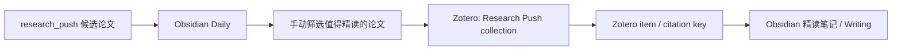

# Zotero Integration

Zotero 作为正式文献资产库，Obsidian 作为研究笔记和写作工作台。默认策略是轻量连接：每日推送不会自动批量写入 Zotero，只创建或确认一个 `Research Push` collection 作为入口。

## 数据流



## Zotero Collection

初始化会创建或复用：

- `Research Push`

默认只建这个根 collection，避免频繁改动已有 Zotero library。如果以后需要，也可以手动创建 topic 子 collection。

## Obsidian 输出

只有显式同步过的条目，日报才会出现：

```md
- Zotero：[zotero://select/library/items/XXXX](zotero://select/library/items/XXXX)
- Citation key：`@author2026title`
```

## 手动命令

只创建或确认 Zotero 子文件夹：

```powershell
$env:PYTHONPATH = ".system"
python -m research_push zotero-init
```

每日流程默认不动 Zotero：

```powershell
$env:PYTHONPATH = ".system"
python -m research_push daily
```

需要时再手动同步少量精选条目：

```powershell
python -m research_push zotero-sync --date today --topic point_cloud_geometry_compression --limit 5
```

## 配置

`.env` 需要：

```env
ZOTERO_API_KEY=你的key
ZOTERO_USER_ID=数字userID
```

`ZOTERO_USER_ID` 必须是数字，例如 `12793234`，不是用户名。
